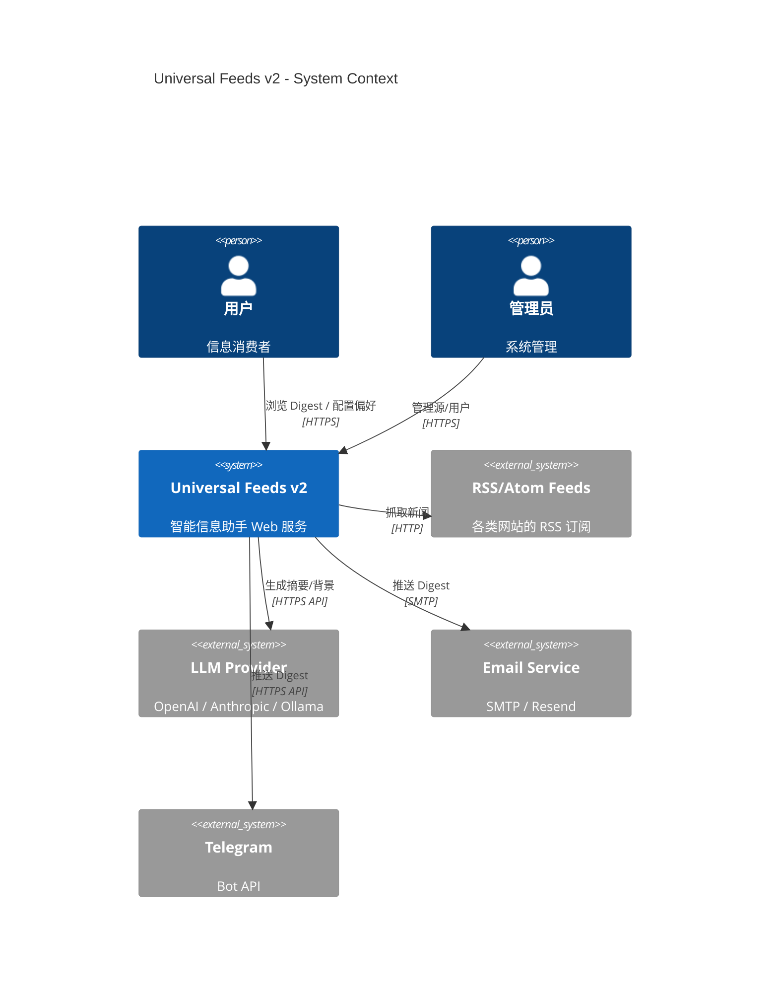
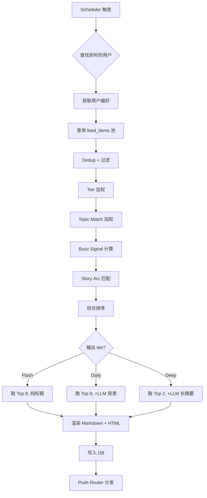

# ArcLight — 技术架构文档

**角色**：系统架构设计（对应 PRD v2.0 Draft）
**作者**：Opus（系统架构师）
**日期**：2026-03-06
**状态**：Draft v1.0

---

## 目录

1. [Executive Summary](#1-executive-summary)
2. [技术选型](#2-技术选型)
3. [系统架构](#3-系统架构)
4. [数据模型](#4-数据模型)
5. [账号系统](#5-账号系统)
6. [API 设计](#6-api-设计)
7. [Web 前端架构](#7-web-前端架构)
8. [Feed 采集引擎](#8-feed-采集引擎)
9. [AI/LLM 集成](#9-aillm-集成)
10. [推送系统](#10-推送系统)
11. [部署方案](#11-部署方案)
12. [扩展性设计](#12-扩展性设计)
13. [MVP 范围与技术债控制](#13-mvp-范围与技术债控制)
14. [任务计划](#14-任务计划)
15. [验收标准](#15-验收标准)

---

## 1. Executive Summary

### 项目定位变化

| 维度 | v1 | v2 |
|------|----|----|
| 形态 | OpenClaw Skill / CLI | 独立 Web 服务 |
| 用户 | 单用户 self-hosted | 多用户，支持注册 |
| 配置 | YAML 文件 | Web UI |
| 投递 | cron + iMessage | 多渠道（Web/Email/Telegram/微信） |
| 状态管理 | JSONL 文件 | 数据库 |
| 代码规模 | ~1000 行 JS | 预估 MVP ~8000-12000 行 |

### 架构决策总览

| 决策点 | 选择 | 理由 |
|--------|------|------|
| 架构风格 | **模块化单体** (Modular Monolith) | MVP 阶段不需要微服务的复杂度 |
| 后端语言 | **TypeScript (Node.js)** | 复用 v1 全部 adapter 代码 |
| 后端框架 | **Hono** | 极轻量、类型安全、支持多运行时 |
| 前端框架 | **React + Vite** | 生态成熟、shadcn/ui 组件库 |
| 数据库 | **SQLite** (MVP) → **PostgreSQL** (Scale) | SQLite 零运维，Drizzle ORM 平滑迁移 |
| ORM | **Drizzle** | 类型安全、SQL-first、支持 SQLite/PG 切换 |
| 任务调度 | **内置 Scheduler** (MVP) → **BullMQ** (Scale) | MVP 不引入 Redis 依赖 |
| 认证 | **better-auth** | 轻量、支持多策略、TypeScript 原生 |
| LLM 集成 | **Vercel AI SDK** | 统一接口、流式输出、多 provider |
| 部署 | **Docker Compose** | 一键启动，self-hosted 友好 |

---

## 2. 技术选型

### 2.1 后端框架对比

| 框架 | 性能 | 学习曲线 | 生态 | 适配度 | 推荐 |
|------|------|---------|------|--------|------|
| **Hono** | ⭐⭐⭐⭐⭐ | 低 | 中（快速增长） | 高 | ✅ **推荐** |
| Fastify | ⭐⭐⭐⭐ | 中 | 大 | 高 | 备选 |
| Express | ⭐⭐⭐ | 低 | 最大 | 中 | 过于陈旧 |
| NestJS | ⭐⭐⭐⭐ | 高 | 大 | 低 | 太重 |

**选 Hono 的理由**：
- 零依赖核心，bundle size < 20KB
- 原生 TypeScript，类型推导优秀
- middleware 生态（cors, jwt, zod-validator）够用
- 支持 Node.js / Bun / Deno / Cloudflare Workers，未来部署灵活
- RPC 模式支持前端 type-safe API 调用（类似 tRPC 但更轻）

### 2.2 前端框架对比

| 框架 | 性能 | 适配度 | SSR | 推荐 |
|------|------|--------|-----|------|
| **React + Vite** | ⭐⭐⭐⭐ | 高 | 不需要 | ✅ **推荐** |
| Next.js | ⭐⭐⭐⭐ | 中 | 强 | 过重（SSR 非必要） |
| Vue + Vite | ⭐⭐⭐⭐ | 高 | 可选 | 可行但团队熟悉度未知 |
| Svelte | ⭐⭐⭐⭐⭐ | 中 | 可选 | 生态偏小 |

**选 React + Vite 的理由**：
- 前端主要是**配置面板 + Digest 阅读器**，SPA 足够，不需要 SSR/SSG
- shadcn/ui 提供高质量的 headless 组件（基于 Radix）
- TailwindCSS v4 零配置
- Vite 构建极快，HMR 体验好
- 前端产物可以作为 static files 由 Hono 直接 serve

### 2.3 数据库选型

| 数据库 | 运维成本 | 性能 | 多用户 | 迁移难度 | 推荐 |
|--------|---------|------|--------|---------|------|
| **SQLite** | 零 | 读快/写够 | 够用 (≤100 用户) | - | ✅ MVP |
| **PostgreSQL** | 中 | 全面强 | 无限 | 低（Drizzle） | ✅ Scale |
| MongoDB | 中 | 好 | 好 | 高 | ❌ 不适合关系型数据 |
| MySQL | 中 | 好 | 好 | 低 | ❌ PG 更好 |

**两阶段策略**：
1. **MVP → SQLite**：单文件数据库，零运维，Docker 挂载即持久化。SQLite 的 WAL 模式支持并发读 + 序列化写，对 ≤100 用户完全够用。
2. **Scale → PostgreSQL**：当并发写成为瓶颈时（预估 >100 活跃用户），通过 Drizzle ORM 的 dialect 切换平滑迁移。Schema 完全相同，只需改 connection 配置。

### 2.4 完整技术栈清单

```
┌─ Runtime ────────────────────────────────┐
│  Node.js 22+ LTS (或 Bun 1.x)            │
├─ Backend ────────────────────────────────┤
│  Hono          — HTTP 框架               │
│  Drizzle ORM   — 数据库                  │
│  better-auth   — 认证                    │
│  Zod           — Schema 校验              │
│  node-cron     — 任务调度 (MVP)           │
│  pino          — 日志                    │
├─ Frontend ───────────────────────────────┤
│  React 19      — UI 框架                 │
│  Vite 6        — 构建工具                 │
│  TailwindCSS 4 — 样式                    │
│  shadcn/ui     — 组件库                   │
│  TanStack Query — 数据请求 + 缓存         │
│  Zustand       — 状态管理                 │
│  Recharts      — 图表可视化               │
├─ AI / LLM ───────────────────────────────┤
│  Vercel AI SDK — 统一 LLM 调用            │
│  OpenAI / Anthropic / Ollama provider     │
├─ Infra ──────────────────────────────────┤
│  SQLite (MVP) → PostgreSQL (Scale)       │
│  Docker + Docker Compose                  │
│  GitHub Actions — CI/CD                   │
└──────────────────────────────────────────┘
```

---

## 3. 系统架构

### 3.1 架构风格：模块化单体

**不做微服务。** 原因：
- 团队小（甚至可能就一人 + AI），微服务的运维、部署、调试成本远大于收益
- 功能之间耦合紧密（Feed 采集 → 排序 → Story Arc → 渲染，是一条 pipeline）
- Self-hosted 场景下，用户期望 `docker compose up` 一键启动
- 模块化单体可以在需要时拆分，但现在不需要

**模块化的含义**：代码按模块组织，模块之间通过明确定义的接口通信，可以独立测试。但运行在同一个进程中。

### 3.2 系统总览

```
                    ┌──────────────────────────────────────────────┐
                    │              Universal Feeds v2               │
                    │            (Single Process / Monolith)        │
                    │                                              │
    ┌───────────┐   │  ┌──────────┐  ┌──────────┐  ┌──────────┐  │
    │  Browser  │◄──┼──┤  Static  │  │   API    │  │   Auth   │  │
    │  (React)  │   │  │  Server  │  │  Router  │  │  Module  │  │
    └───────────┘   │  └──────────┘  └────┬─────┘  └──────────┘  │
                    │                     │                        │
                    │         ┌───────────┼───────────┐            │
                    │         ▼           ▼           ▼            │
                    │  ┌──────────┐ ┌──────────┐ ┌──────────┐    │
                    │  │  Feed    │ │  Digest  │ │  User    │    │
                    │  │  Engine  │ │  Engine  │ │  Prefs   │    │
                    │  └────┬─────┘ └────┬─────┘ └──────────┘    │
                    │       │            │                        │
                    │  ┌────▼─────┐ ┌────▼─────┐                 │
                    │  │ Adapters │ │  Story   │                 │
                    │  │ RSS/X/.. │ │  Arc     │                 │
                    │  └──────────┘ │  Engine  │                 │
                    │               └──────────┘                 │
                    │                                             │
                    │  ┌──────────┐  ┌──────────┐  ┌──────────┐  │
                    │  │ Scheduler│  │   LLM   │  │  Push    │  │
                    │  │ (Cron)   │  │  Service │  │  Router  │  │
                    │  └──────────┘  └──────────┘  └──────────┘  │
                    │                                             │
                    │  ┌───────────────────────────────────────┐  │
                    │  │          SQLite / PostgreSQL           │  │
                    │  └───────────────────────────────────────┘  │
                    └──────────────────────────────────────────────┘
```

### 3.3 模块划分

```
src/
├── index.ts                    # 入口：启动 Hono server + scheduler
├── db/
│   ├── schema.ts               # Drizzle schema 定义（所有表）
│   ├── migrate.ts              # 迁移脚本
│   └── client.ts               # DB 连接工厂 (SQLite | PG)
├── auth/
│   ├── config.ts               # better-auth 配置
│   └── middleware.ts           # 认证中间件
├── api/
│   ├── routes.ts               # 路由注册中心
│   ├── feeds.ts                # Feed Source CRUD
│   ├── digests.ts              # Digest 查看/重新生成
│   ├── arcs.ts                 # Story Arc 查看/手动管理
│   ├── preferences.ts         # 用户偏好设置
│   ├── push.ts                 # 推送渠道配置
│   └── admin.ts                # 管理接口
├── engine/
│   ├── pipeline.ts             # 主 Pipeline 编排器
│   ├── adapters/               # 数据源适配器（复用 v1）
│   │   ├── rss.ts
│   │   ├── x-bird.ts
│   │   ├── v2ex.ts
│   │   ├── youtube.ts
│   │   ├── wechat-mp.ts
│   │   └── google-news.ts     # 新增
│   ├── normalize.ts            # 统一格式化
│   ├── enrich.ts               # Tier 标注 + Entity 提取 + 语言检测
│   ├── dedup.ts                # 去重 + 聚类
│   ├── buzz.ts                 # Buzz Signal 计算
│   ├── rank.ts                 # 排序引擎
│   ├── serendipity.ts          # 视野扩展选择器
│   └── render.ts               # Multi-tier 渲染器
├── arc/
│   ├── matcher.ts              # Arc 匹配算法
│   ├── lifecycle.ts            # Arc 状态机 (active/dormant/closed)
│   └── store.ts                # Arc 持久化（DB 读写）
├── llm/
│   ├── client.ts               # LLM 调用封装（Vercel AI SDK）
│   ├── context-inject.ts       # 背景注入 prompt + batch
│   ├── summarize.ts            # 摘要生成
│   └── arc-confirm.ts          # Arc 匹配确认（模糊区 LLM 判断）
├── push/
│   ├── router.ts               # 推送路由（按用户配置分发）
│   ├── channels/
│   │   ├── web.ts              # Web 站内信 / SSE
│   │   ├── email.ts            # Email (nodemailer / Resend)
│   │   ├── telegram.ts         # Telegram Bot API
│   │   └── webhook.ts          # 通用 Webhook（将来微信等）
│   └── templates/
│       ├── flash.ts            # Flash 模板
│       ├── daily.ts            # Daily 模板
│       ├── deep.ts             # Deep 模板
│       └── weekly.ts           # Weekly 模板
├── scheduler/
│   ├── cron.ts                 # 定时任务管理
│   ├── jobs/
│   │   ├── fetch-feeds.ts      # 定时抓取
│   │   ├── generate-digest.ts  # 定时生成 Digest
│   │   ├── push-digest.ts      # 定时推送
│   │   └── arc-maintenance.ts  # Arc 生命周期维护
│   └── queue.ts                # 任务队列（MVP: 内存 / Scale: BullMQ）
├── consumption/
│   ├── tracker.ts              # 消费行为记录
│   ├── analyzer.ts             # 偏好分析（topic CTR 计算）
│   └── personalize.ts         # 个性化调权
└── shared/
    ├── config.ts               # 全局配置加载
    ├── logger.ts               # pino logger
    ├── errors.ts               # 统一错误类型
    └── types.ts                # 共享 TypeScript 类型
```

### 3.4 请求流与数据流

#### 请求流（Web UI 操作）

```
Browser → Hono Static Server → React SPA
Browser → Hono API Router → Auth Middleware → API Handler → DB → Response
```

#### 数据流（Feed 采集与 Digest 生成）

```
Scheduler (cron)
  │
  ├─ Job: fetch-feeds
  │   └─ Pipeline: adapters → normalize → enrich → DB (feed_items)
  │
  ├─ Job: generate-digest (per user)
  │   └─ Pipeline: DB query → dedup → buzz calc → arc match
  │                 → rank → context inject → serendipity
  │                 → render (flash/daily/deep/weekly)
  │                 → DB (digests)
  │
  └─ Job: push-digest (per user)
      └─ Push Router → channel handler → delivery
```

**关键设计决策**：Feed 采集是**全局的**（所有用户共享数据源），Digest 生成是**per-user 的**（每个用户有自己的偏好、Topic、Story Arc）。

```
全局层：Feed Source → FeedItem（共享池）
           │
           │  per-user filter + rank
           ▼
用户层：User Preferences → Digest（个性化输出）
```

这意味着：
- 同一条新闻只抓一次，多用户复用
- 排序、故事线匹配、serendipity 选择是 per-user 计算
- 这与 v1 的单用户模型有本质区别

---

## 4. 数据模型

### 4.1 ER 图

```
┌──────────┐     ┌───────────────┐     ┌─────────────┐
│  users   │     │  feed_sources │     │  feed_items  │
├──────────┤     ├───────────────┤     ├─────────────┤
│ id       │──┐  │ id            │──┐  │ id          │
│ email    │  │  │ name          │  │  │ source_id   │─→ feed_sources.id
│ name     │  │  │ url           │  ├──│ title       │
│ password │  │  │ type          │  │  │ url         │
│ role     │  │  │ tier          │  │  │ content     │
│ timezone │  │  │ category      │  │  │ author      │
│ ...      │  │  │ tags          │  │  │ language    │
└──────────┘  │  │ enabled       │  │  │ published_at│
              │  │ fetch_config  │  │  │ fetched_at  │
              │  └───────────────┘  │  │ tier        │
              │                     │  │ entities    │
              │                     │  │ metrics     │
              │  ┌───────────────┐  │  │ buzz_data   │
              │  │  user_sources │  │  │ dedup_hash  │
              │  ├───────────────┤  │  └─────────────┘
              ├──│ user_id      │  │         │
              │  │ source_id    │──┘         │
              │  │ custom_weight│         ┌──┴──────────┐
              │  │ custom_tags  │         │             │
              │  └───────────────┘   ┌────▼──────┐ ┌───▼──────────┐
              │                      │ story_arcs│ │arc_items     │
              │  ┌────────────────┐  ├───────────┤ ├──────────────┤
              │  │user_preferences│  │ id        │ │ arc_id       │
              │  ├────────────────┤  │ user_id   │ │ item_id      │
              ├──│ user_id       │  │ title     │ │ position     │
              │  │ topics        │  │ summary   │ │ added_at     │
              │  │ schedule      │  │ tags      │ └──────────────┘
              │  │ push_channels │  │ status    │
              │  │ serendipity   │  │ entities  │
              │  │ llm_config    │  │ first_seen│
              │  └────────────────┘  │ last_upd  │
              │                      │ item_count│
              │  ┌────────────────┐  └───────────┘
              │  │   digests      │
              │  ├────────────────┤
              ├──│ user_id       │
              │  │ tier (flash/..)│
              │  │ date          │
              │  │ content_md    │
              │  │ content_html  │
              │  │ items (json)  │
              │  │ created_at    │
              │  │ pushed_at     │
              │  │ push_status   │
              │  └────────────────┘
              │
              │  ┌────────────────┐
              │  │ consumption    │
              │  ├────────────────┤
              └──│ user_id       │
                 │ item_id       │
                 │ digest_id     │
                 │ action        │
                 │ tier          │
                 │ created_at    │
                 └────────────────┘
```

### 4.2 Drizzle Schema 定义

```typescript
// db/schema.ts

import { sqliteTable, text, integer, real, blob } from 'drizzle-orm/sqlite-core';

// ═══════════════════════════════════════════
// Users & Auth
// ═══════════════════════════════════════════

export const users = sqliteTable('users', {
  id: text('id').primaryKey(),                    // nanoid
  email: text('email').notNull().unique(),
  name: text('name'),
  passwordHash: text('password_hash'),            // bcrypt
  role: text('role', { enum: ['user', 'admin'] }).default('user'),
  timezone: text('timezone').default('UTC'),
  locale: text('locale').default('zh-CN'),
  avatarUrl: text('avatar_url'),
  createdAt: integer('created_at', { mode: 'timestamp' }).notNull(),
  updatedAt: integer('updated_at', { mode: 'timestamp' }).notNull(),
});

export const sessions = sqliteTable('sessions', {
  id: text('id').primaryKey(),
  userId: text('user_id').notNull().references(() => users.id),
  token: text('token').notNull().unique(),
  expiresAt: integer('expires_at', { mode: 'timestamp' }).notNull(),
  createdAt: integer('created_at', { mode: 'timestamp' }).notNull(),
});

// ═══════════════════════════════════════════
// Feed Sources
// ═══════════════════════════════════════════

export const feedSources = sqliteTable('feed_sources', {
  id: text('id').primaryKey(),                    // nanoid
  name: text('name').notNull(),
  url: text('url').notNull(),
  type: text('type', {
    enum: ['rss', 'atom', 'x', 'v2ex', 'youtube', 'wechat', 'google-news', 'custom']
  }).notNull(),
  tier: integer('tier').notNull().default(3),      // 1-4
  category: text('category'),                      // politics, tech, finance, ...
  tags: text('tags', { mode: 'json' }).$type<string[]>().default([]),
  language: text('language'),                      // en, zh, ja, ...
  enabled: integer('enabled', { mode: 'boolean' }).default(true),
  fetchConfig: text('fetch_config', { mode: 'json' }).$type<{
    intervalMinutes?: number;
    maxItems?: number;
    timeout?: number;
    auth?: { type: string; token?: string };
  }>(),
  lastFetchedAt: integer('last_fetched_at', { mode: 'timestamp' }),
  lastFetchStatus: text('last_fetch_status'),      // ok, error, timeout
  fetchErrorCount: integer('fetch_error_count').default(0),
  isGlobal: integer('is_global', { mode: 'boolean' }).default(false),  // 全局源 vs 用户添加
  createdBy: text('created_by').references(() => users.id),
  createdAt: integer('created_at', { mode: 'timestamp' }).notNull(),
});

// 用户与 Source 的关联（订阅关系 + 自定义配置）
export const userSources = sqliteTable('user_sources', {
  id: text('id').primaryKey(),
  userId: text('user_id').notNull().references(() => users.id),
  sourceId: text('source_id').notNull().references(() => feedSources.id),
  enabled: integer('enabled', { mode: 'boolean' }).default(true),
  customWeight: real('custom_weight'),             // 覆盖默认权重
  customTags: text('custom_tags', { mode: 'json' }).$type<string[]>(),
  createdAt: integer('created_at', { mode: 'timestamp' }).notNull(),
});

// ═══════════════════════════════════════════
// Feed Items
// ═══════════════════════════════════════════

export const feedItems = sqliteTable('feed_items', {
  id: text('id').primaryKey(),                    // nanoid
  sourceId: text('source_id').notNull().references(() => feedSources.id),
  externalId: text('external_id'),                // 原始平台 ID（去重用）
  url: text('url').notNull(),
  title: text('title'),
  content: text('content'),                        // 正文/摘要
  author: text('author', { mode: 'json' }).$type<{
    name?: string;
    handle?: string;
    avatarUrl?: string;
  }>(),
  language: text('language'),
  tier: integer('tier'),                           // 继承自 source 或独立判断
  publishedAt: integer('published_at', { mode: 'timestamp' }),
  fetchedAt: integer('fetched_at', { mode: 'timestamp' }).notNull(),

  // 指标
  metrics: text('metrics', { mode: 'json' }).$type<{
    likes?: number;
    reposts?: number;
    replies?: number;
    views?: number;
  }>(),

  // Buzz Signal 数据
  buzzData: text('buzz_data', { mode: 'json' }).$type<{
    crossSourceCount?: number;
    socialEngagement?: number;
    velocity?: number;
    score?: number;
  }>(),

  // 实体提取结果
  entities: text('entities', { mode: 'json' }).$type<string[]>().default([]),
  tags: text('tags', { mode: 'json' }).$type<string[]>().default([]),

  // 去重
  dedupHash: text('dedup_hash'),                   // 标题 + URL 的 hash
  dedupClusterId: text('dedup_cluster_id'),         // 同一事件的聚类 ID

  // LLM 生成
  contextInjection: text('context_injection'),      // 一句话背景
  whyImportant: text('why_important'),              // "为什么重要"

  createdAt: integer('created_at', { mode: 'timestamp' }).notNull(),
});

// ═══════════════════════════════════════════
// Story Arcs
// ═══════════════════════════════════════════

export const storyArcs = sqliteTable('story_arcs', {
  id: text('id').primaryKey(),                    // nanoid
  userId: text('user_id').notNull().references(() => users.id),  // per-user
  title: text('title').notNull(),
  summary: text('summary'),                        // LLM 生成
  tags: text('tags', { mode: 'json' }).$type<string[]>().default([]),
  entities: text('entities', { mode: 'json' }).$type<string[]>().default([]),
  status: text('status', {
    enum: ['active', 'dormant', 'closed']
  }).notNull().default('active'),
  firstSeen: integer('first_seen', { mode: 'timestamp' }).notNull(),
  lastUpdated: integer('last_updated', { mode: 'timestamp' }).notNull(),
  itemCount: integer('item_count').default(0),
  timeline: text('timeline', { mode: 'json' }).$type<{
    date: string;
    headline: string;
    itemId: string;
  }[]>(),
  createdAt: integer('created_at', { mode: 'timestamp' }).notNull(),
});

export const arcItems = sqliteTable('arc_items', {
  id: text('id').primaryKey(),
  arcId: text('arc_id').notNull().references(() => storyArcs.id),
  itemId: text('item_id').notNull().references(() => feedItems.id),
  position: integer('position').notNull(),         // 在 Arc 中的时间顺序
  addedAt: integer('added_at', { mode: 'timestamp' }).notNull(),
});

// ═══════════════════════════════════════════
// User Preferences
// ═══════════════════════════════════════════

export const userPreferences = sqliteTable('user_preferences', {
  id: text('id').primaryKey(),
  userId: text('user_id').notNull().references(() => users.id).unique(),

  // Topic 偏好
  topics: text('topics', { mode: 'json' }).$type<{
    name: string;
    keywords: string[];
    excludeKeywords?: string[];
    boost: number;
  }[]>().default([]),

  // 排序配置
  ranking: text('ranking', { mode: 'json' }).$type<{
    tierWeights?: Record<number, number>;
    buzzWeight?: number;
    recencyHours?: number;
    arcActiveBoost?: number;
  }>(),

  // 输出调度
  schedule: text('schedule', { mode: 'json' }).$type<{
    flash?: { enabled: boolean; time: string; count: number };
    daily?: { enabled: boolean; time: string; count: number };
    deep?:  { enabled: boolean; time: string; count: number };
    weekly?: { enabled: boolean; dayOfWeek: number; time: string };
    buzz?:   { enabled: boolean; time: string; count: number };
  }>(),

  // 推送渠道
  pushChannels: text('push_channels', { mode: 'json' }).$type<{
    web?: { enabled: boolean };
    email?: { enabled: boolean; address?: string };
    telegram?: { enabled: boolean; chatId?: string; botToken?: string };
    webhook?: { enabled: boolean; url?: string };
  }>(),

  // Serendipity 配置
  serendipity: text('serendipity', { mode: 'json' }).$type<{
    enabled: boolean;
    slotsPerDigest: number;
    strategy: string;
    minBuzz?: number;
  }>(),

  // LLM 配置
  llmConfig: text('llm_config', { mode: 'json' }).$type<{
    provider?: string;           // openai, anthropic, ollama
    model?: string;
    apiKey?: string;             // 加密存储
    contextInjection?: boolean;
    arcConfirm?: boolean;
  }>(),

  // Alert 配置
  alerts: text('alerts', { mode: 'json' }).$type<{
    enabled: boolean;
    minBuzz?: number;
    minTier1Sources?: number;
    cooldownHours?: number;
    quietHours?: string;
  }>(),

  updatedAt: integer('updated_at', { mode: 'timestamp' }).notNull(),
});

// ═══════════════════════════════════════════
// Digests (生成的产物)
// ═══════════════════════════════════════════

export const digests = sqliteTable('digests', {
  id: text('id').primaryKey(),
  userId: text('user_id').notNull().references(() => users.id),
  tier: text('tier', {
    enum: ['flash', 'daily', 'deep', 'weekly', 'buzz', 'alert']
  }).notNull(),
  date: text('date').notNull(),                    // YYYY-MM-DD
  contentMarkdown: text('content_markdown'),
  contentHtml: text('content_html'),
  itemIds: text('item_ids', { mode: 'json' }).$type<string[]>().default([]),
  arcIds: text('arc_ids', { mode: 'json' }).$type<string[]>(),   // weekly 用
  metadata: text('metadata', { mode: 'json' }).$type<{
    itemCount: number;
    generatedAt: string;
    llmCost?: number;             // LLM 调用成本估算
    pipelineDurationMs?: number;
  }>(),
  createdAt: integer('created_at', { mode: 'timestamp' }).notNull(),
  pushedAt: integer('pushed_at', { mode: 'timestamp' }),
  pushStatus: text('push_status', { enum: ['pending', 'sent', 'failed'] }).default('pending'),
});

// ═══════════════════════════════════════════
// Consumption Memory
// ═══════════════════════════════════════════

export const consumption = sqliteTable('consumption', {
  id: text('id').primaryKey(),
  userId: text('user_id').notNull().references(() => users.id),
  itemId: text('item_id').notNull().references(() => feedItems.id),
  digestId: text('digest_id').references(() => digests.id),
  action: text('action', {
    enum: ['delivered', 'viewed', 'clicked', 'skipped', 'bookmarked', 'feedback_up', 'feedback_down']
  }).notNull(),
  tier: text('tier'),                              // 在哪个 tier 被看到的
  createdAt: integer('created_at', { mode: 'timestamp' }).notNull(),
});
```

### 4.3 索引设计

```typescript
// 性能关键索引
import { index } from 'drizzle-orm/sqlite-core';

// feed_items: 按时间范围查询 + 去重
// CREATE INDEX idx_feed_items_published ON feed_items(published_at);
// CREATE INDEX idx_feed_items_dedup ON feed_items(dedup_hash);
// CREATE INDEX idx_feed_items_source ON feed_items(source_id, published_at);

// story_arcs: 按用户 + 状态查询
// CREATE INDEX idx_arcs_user_status ON story_arcs(user_id, status);

// digests: 按用户 + 日期查询
// CREATE INDEX idx_digests_user_date ON digests(user_id, date, tier);

// consumption: 按用户 + 时间范围查询（偏好分析）
// CREATE INDEX idx_consumption_user ON consumption(user_id, created_at);
// CREATE INDEX idx_consumption_item ON consumption(item_id, user_id);
```

### 4.4 数据量估算

| 表 | 每日增量 | 30 天累计 | 清理策略 |
|----|---------|----------|---------|
| feed_items | ~500-2000 条 | ~30K-60K | 保留 90 天，之后只保留被 Arc 引用的 |
| story_arcs | ~2-5 新增 | ~60-150 | 永久保留（closed 可归档） |
| digests | ~3-5 / 用户 | ~100 / 用户 | 保留 90 天 |
| consumption | ~10-50 / 用户 | ~300-1500 / 用户 | 保留 30 天详细 + 聚合统计永久 |

SQLite 单文件大小预估：单用户 30 天 ~50MB，10 用户 ~200MB，完全可控。

---

## 5. 账号系统

### 5.1 认证方案

使用 **better-auth** 库，理由：
- TypeScript 原生，类型安全
- 内置 email/password、OAuth（Google/GitHub）、magic link 等策略
- 自带 session 管理（DB-backed session，不是 stateless JWT）
- 支持 Drizzle ORM 作为 adapter
- 社区活跃，文档好

### 5.2 认证流程

```
┌─ MVP ──────────────────────────────────────┐
│                                             │
│  注册方式:                                    │
│  ├─ Email + Password                        │
│  └─ Invite Code（首批用户需要邀请码）          │
│                                             │
│  登录方式:                                    │
│  └─ Email + Password → Session Cookie       │
│                                             │
│  Session:                                    │
│  └─ DB-backed, HttpOnly cookie, 30 天有效    │
│                                             │
└─────────────────────────────────────────────┘

┌─ Phase 2 ──────────────────────────────────┐
│                                             │
│  新增:                                       │
│  ├─ OAuth: Google / GitHub                  │
│  ├─ Magic Link (邮箱验证登录)                 │
│  └─ API Key (用于外部集成 / CLI)              │
│                                             │
└─────────────────────────────────────────────┘
```

### 5.3 权限模型

简单的 RBAC，两个角色足够：

| 角色 | 权限 |
|------|------|
| **admin** | 全部：管理全局 Feed Source、管理用户、系统配置 |
| **user** | 自身：管理自己的偏好、Topic、Story Arc、推送配置 |

```typescript
// auth/middleware.ts
export function requireAuth() {
  return async (c: Context, next: Next) => {
    const session = await auth.getSession(c.req.raw);
    if (!session) return c.json({ error: 'Unauthorized' }, 401);
    c.set('user', session.user);
    await next();
  };
}

export function requireAdmin() {
  return async (c: Context, next: Next) => {
    const user = c.get('user');
    if (user.role !== 'admin') return c.json({ error: 'Forbidden' }, 403);
    await next();
  };
}
```

### 5.4 首次启动引导

```
docker compose up
  │
  ├─ DB migration (auto)
  │
  ├─ 检测是否有 admin 用户
  │   ├─ 没有 → 进入 Setup Wizard
  │   │   ├─ 创建 admin 账号
  │   │   ├─ 导入默认 Feed Source Packs
  │   │   ├─ 设置 LLM provider
  │   │   └─ 完成 → 跳转到 Dashboard
  │   │
  │   └─ 有 → 正常登录页
```

### 5.5 API Key（Phase 2）

用于非浏览器场景（CLI、Telegram bot 回调等）：

```
Authorization: Bearer uf_sk_xxxxxxxxxxxx
```

API Key 特性：
- 绑定到用户，继承用户权限
- 可以有多个（每个场景一个）
- 支持权限范围限制（只读 / 读写）
- Hash 存储（bcrypt），只在创建时展示一次

---

## 6. API 设计

### 6.1 API 总览

RESTful JSON API，通过 Hono 的 RPC 模式自动生成前端类型。

```
API Base: /api/v1

── Auth ─────────────────────────────
POST   /auth/register              注册
POST   /auth/login                 登录
POST   /auth/logout                登出
GET    /auth/me                    当前用户信息

── Feed Sources ─────────────────────
GET    /sources                    列出可用 Feed Source
POST   /sources                    添加 Feed Source (admin)
PUT    /sources/:id                更新 Feed Source (admin)
DELETE /sources/:id                删除 Feed Source (admin)
POST   /sources/import             从 YAML/OPML 批量导入 (admin)
GET    /sources/packs              列出 Source Pack 模板

── User Sources (订阅) ──────────────
GET    /me/sources                 我订阅的 Source 列表
POST   /me/sources                 订阅一个 Source
PUT    /me/sources/:id             调整权重/标签
DELETE /me/sources/:id             取消订阅

── User Preferences ─────────────────
GET    /me/preferences             获取偏好设置
PUT    /me/preferences             更新偏好设置
PUT    /me/preferences/topics      更新 Topic 列表
PUT    /me/preferences/schedule    更新推送时间表
PUT    /me/preferences/push        更新推送渠道

── Digests ──────────────────────────
GET    /me/digests                 列出我的 Digest 历史
GET    /me/digests/latest          获取最新 Digest
GET    /me/digests/:id             获取特定 Digest
POST   /me/digests/generate        手动触发生成（指定 tier）
GET    /me/digests/:id/items       获取 Digest 中的 items 详情

── Story Arcs ───────────────────────
GET    /me/arcs                    列出我的 Story Arc
GET    /me/arcs/:id                获取 Arc 详情（含 timeline）
PUT    /me/arcs/:id                手动编辑 Arc（改标题、合并等）
POST   /me/arcs/:id/follow         关注此 Arc（保持活跃更久）
DELETE /me/arcs/:id/follow         取消关注

── Feed Items ───────────────────────
GET    /items                      搜索/浏览 Feed Items
GET    /items/:id                  获取 Item 详情

── Consumption ──────────────────────
POST   /me/consumption             记录消费行为
GET    /me/stats                   个人消费统计

── Admin ────────────────────────────
GET    /admin/users                用户列表
GET    /admin/stats                系统统计（总 items、源状态等）
POST   /admin/fetch                手动触发全局抓取
GET    /admin/jobs                 查看调度任务状态
```

### 6.2 关键 API 详细设计

#### Digest 手动生成

```http
POST /api/v1/me/digests/generate
Content-Type: application/json

{
  "tier": "daily",         // flash | daily | deep | weekly
  "date": "2026-03-06",   // 可选，默认今天
  "dryRun": false          // true = 只返回结果不持久化
}
```

Response:
```json
{
  "id": "dgst_abc123",
  "tier": "daily",
  "date": "2026-03-06",
  "contentMarkdown": "📰 2026-03-06 今日精选\n\n1. 🔥 ...",
  "items": [ /* item objects */ ],
  "metadata": {
    "itemCount": 8,
    "generatedAt": "2026-03-06T09:00:00Z",
    "pipelineDurationMs": 2340,
    "llmCost": 0.003
  }
}
```

#### 消费行为记录

```http
POST /api/v1/me/consumption
Content-Type: application/json

{
  "itemId": "fi_xyz789",
  "digestId": "dgst_abc123",
  "action": "clicked"       // viewed | clicked | bookmarked | feedback_up | feedback_down
}
```

### 6.3 Hono RPC 类型安全

Hono 的 RPC 模式允许前端直接获取 API 的类型签名，无需手动维护 SDK：

```typescript
// backend: api/routes.ts
const app = new Hono()
  .get('/me/digests', requireAuth(), async (c) => {
    const digests = await getDigests(c.get('user').id);
    return c.json(digests);
  })
  .post('/me/digests/generate', requireAuth(), zValidator('json', generateSchema), async (c) => {
    const body = c.req.valid('json');
    const digest = await generateDigest(c.get('user').id, body);
    return c.json(digest);
  });

export type AppType = typeof app;

// frontend: lib/api.ts
import { hc } from 'hono/client';
import type { AppType } from '../../../src/api/routes';

const client = hc<AppType>('/api/v1');

// 完全类型安全的 API 调用
const res = await client.me.digests.$get();
const digests = await res.json(); // 类型自动推导
```

---

## 7. Web 前端架构

### 7.1 页面结构

```
/                           → 重定向到 /login 或 /dashboard
/login                      → 登录页
/register                   → 注册页（需要邀请码）
/setup                      → 首次启动引导

/dashboard                  → 主面板（最新 Digest + 快速统计）
/digests                    → Digest 历史列表
/digests/:id                → 单个 Digest 阅读页
/arcs                       → Story Arc 列表 + 可视化
/arcs/:id                   → 单个 Arc 详情 + Timeline

/settings                   → 设置总览
/settings/sources           → 我的 Feed Source 管理
/settings/topics            → Topic 偏好配置
/settings/schedule          → 推送时间表
/settings/push              → 推送渠道配置
/settings/llm               → LLM Provider 配置
/settings/account           → 账号信息

/admin                      → 管理面板（仅 admin）
/admin/sources              → 全局 Source 管理
/admin/users                → 用户管理
/admin/jobs                 → 任务调度状态
```

### 7.2 Dashboard（主面板）

```
┌─────────────────────────────────────────────────────────┐
│  Universal Feeds                        [用户头像] [设置] │
├─────────────────────────────────────────────────────────┤
│                                                         │
│  ┌──────────────────────────────────────────────┐       │
│  │  📰 今日精选 — 2026-03-06                     │       │
│  │                                              │       │
│  │  1. 🔥 欧盟 AI 法案合规执法首日               │       │
│  │     📎 2024年通过的全球首个 AI 专项法规         │       │
│  │     📌 故事线: 欧盟 AI 法案 (Day 6)           │       │
│  │     [阅读原文] [👍] [👎] [🔖]                  │       │
│  │                                              │       │
│  │  2. OpenAI 开源 GPT-5 推理模型权重            │       │
│  │     为什么重要: 首次开源旗舰级推理模型...       │       │
│  │     [阅读原文] [👍] [👎] [🔖]                  │       │
│  │                                              │       │
│  │  ... (更多条目)                               │       │
│  │                                              │       │
│  │  💡 意外发现                                  │       │
│  │  冰岛成为全球首个 100% 可再生能源国家          │       │
│  │  → 和你的关注无关，但 7 个国际源同时报道       │       │
│  │                                              │       │
│  └──────────────────────────────────────────────┘       │
│                                                         │
│  ┌─────────────────┐  ┌────────────────────────┐       │
│  │ 🔴 活跃故事线    │  │ 📊 本周统计            │       │
│  │                 │  │                        │       │
│  │ 欧盟 AI 法案    │  │ 抓取: 1,234 条          │       │
│  │ Day 6 · 4 条    │  │ 去重后: 456 条          │       │
│  │                 │  │ 推送: 24 条              │       │
│  │ OpenAI 架构     │  │ 点击率: 62%             │       │
│  │ Day 12 · 3 条   │  │ LLM 费用: $0.12        │       │
│  │                 │  │                        │       │
│  │ [查看全部 →]     │  │ [详细报告 →]            │       │
│  └─────────────────┘  └────────────────────────┘       │
│                                                         │
│  ┌──────────────────────────────────────────────┐       │
│  │ 📜 历史 Digest                                │       │
│  │                                              │       │
│  │ 今天  ⚡ Flash  📰 Daily  🔍 Deep             │       │
│  │ 昨天  ⚡ Flash  📰 Daily  🔍 Deep             │       │
│  │ 前天  ⚡ Flash  📰 Daily  🔍 Deep             │       │
│  │ ...                                          │       │
│  └──────────────────────────────────────────────┘       │
└─────────────────────────────────────────────────────────┘
```

### 7.3 Story Arc 可视化

```
┌──────────────────────────────────────────────────────────┐
│  📌 欧盟 AI 法案                              🔴 活跃    │
│  标签: #regulation #eu #ai-policy                        │
│  追踪天数: 20 · 共 8 条新闻                              │
├──────────────────────────────────────────────────────────┤
│                                                          │
│  Timeline                                                │
│                                                          │
│  2/15 ──●── 欧盟 AI 法案进入最终审议阶段                   │
│         │   来源: Reuters (T1)                            │
│         │                                                │
│  2/20 ──●── 科技公司联名致信欧盟                          │
│         │   来源: FT (T2)                                │
│         │                                                │
│  2/28 ──●── 法案正式生效，6 个月过渡期                     │
│         │   来源: EU Official (T1) + 6 媒体              │
│         │   🔥 Buzz Score: 2.8                           │
│         │                                                │
│  3/01 ──●── 科技公司集体发声批评合规成本                   │
│         │   来源: The Verge (T2) + HN (T3)              │
│         │                                                │
│  3/06 ──●── 首批三家公司被调查 ⬅ 最新                    │
│              来源: Reuters (T1) + BBC (T2)               │
│              🔥 Buzz Score: 3.2                          │
│                                                          │
│  ┌─────────────────────────────────────────┐             │
│  │ AI 摘要: 欧盟 AI 法案从审议到正式生效仅用    │             │
│  │ 了 13 天，生效第 6 天即启动首次执法行动，      │             │
│  │ 执法力度超出市场预期。三家被调查公司均为      │             │
│  │ 美国科技巨头，引发跨大西洋科技监管摩擦。      │             │
│  └─────────────────────────────────────────┘             │
│                                                          │
│  [取消关注] [合并到其他 Arc] [手动添加条目]                │
└──────────────────────────────────────────────────────────┘
```

Timeline 使用 Recharts 的自定义组件或纯 CSS 实现（不需要重型可视化库）。

### 7.4 设置页面 — Topic 偏好

```
┌──────────────────────────────────────────────────────────┐
│  ⚙️ Topic 偏好配置                                       │
├──────────────────────────────────────────────────────────┤
│                                                          │
│  ┌─────────────────────────────────────────────────────┐ │
│  │ AI 产业                                   [编辑] [×] │ │
│  │ 关键词: OpenAI, Anthropic, Claude, GPT, Gemini, LLM │ │
│  │ 排除词: (无)                                        │ │
│  │ 权重: ██████████░░ 2.0x                            │ │
│  └─────────────────────────────────────────────────────┘ │
│                                                          │
│  ┌─────────────────────────────────────────────────────┐ │
│  │ Apple                                     [编辑] [×] │ │
│  │ 关键词: Apple, iPhone, macOS, WWDC, Vision Pro      │ │
│  │ 排除词: apple juice, apple pie                      │ │
│  │ 权重: ████████░░░░ 1.5x                            │ │
│  └─────────────────────────────────────────────────────┘ │
│                                                          │
│  [+ 添加 Topic]                                         │
│                                                          │
│  ── 推荐 Topic 模板 ──                                   │
│  [AI/ML] [前端开发] [加密货币] [地缘政治] [创业投资]       │
│                                                          │
└──────────────────────────────────────────────────────────┘
```

### 7.5 前端技术架构

```
frontend/
├── index.html
├── vite.config.ts
├── tailwind.config.ts
├── src/
│   ├── main.tsx                 # 入口
│   ├── App.tsx                  # 路由 (react-router v7)
│   ├── lib/
│   │   ├── api.ts               # Hono RPC client
│   │   ├── auth.ts              # 认证 hooks
│   │   └── utils.ts
│   ├── hooks/
│   │   ├── useDigests.ts        # TanStack Query hooks
│   │   ├── useArcs.ts
│   │   ├── usePreferences.ts
│   │   └── useConsumption.ts
│   ├── components/
│   │   ├── ui/                  # shadcn/ui 组件
│   │   ├── layout/
│   │   │   ├── Sidebar.tsx
│   │   │   ├── Header.tsx
│   │   │   └── AppLayout.tsx
│   │   ├── digest/
│   │   │   ├── DigestCard.tsx
│   │   │   ├── DigestItem.tsx
│   │   │   ├── SerendipitySlot.tsx
│   │   │   └── DigestReader.tsx
│   │   ├── arc/
│   │   │   ├── ArcCard.tsx
│   │   │   ├── ArcTimeline.tsx
│   │   │   └── ArcList.tsx
│   │   └── settings/
│   │       ├── TopicEditor.tsx
│   │       ├── ScheduleEditor.tsx
│   │       ├── SourcePicker.tsx
│   │       └── PushConfig.tsx
│   ├── pages/
│   │   ├── Dashboard.tsx
│   │   ├── DigestHistory.tsx
│   │   ├── DigestView.tsx
│   │   ├── ArcsPage.tsx
│   │   ├── ArcDetail.tsx
│   │   ├── Settings.tsx
│   │   ├── Login.tsx
│   │   └── Setup.tsx
│   └── stores/
│       └── appStore.ts          # Zustand global state
```

### 7.6 移动端适配

前端采用 **responsive design**，不单独做移动 App。Digest 阅读场景在手机上的核心体验：

- 卡片式布局，单列滚动
- Touch-friendly 交互按钮（👍/👎/🔖 按钮至少 44px）
- PWA 支持（manifest.json + service worker），可添加到主屏幕
- 离线缓存最新的 Digest（service worker）

---

## 8. Feed 采集引擎

### 8.1 采集架构

```
┌───────────────────────────────────────────────────────────┐
│                    Feed Collection Engine                   │
│                                                           │
│  ┌─────────────────┐                                      │
│  │    Scheduler     │  每个 Source 独立调度                  │
│  │  (node-cron)     │  基于 source.fetchConfig.interval    │
│  └────────┬────────┘                                      │
│           │                                                │
│           ▼                                                │
│  ┌─────────────────┐                                      │
│  │  Fetch Manager   │  并发控制 + 重试 + 超时               │
│  │                  │  max_concurrent: 5                   │
│  │                  │  retry: 3 次 exponential backoff     │
│  │                  │  timeout: 30s per source             │
│  └────────┬────────┘                                      │
│           │                                                │
│    ┌──────┼──────┬──────────┬──────────┐                   │
│    ▼      ▼      ▼          ▼          ▼                   │
│  ┌────┐┌────┐┌─────┐┌──────────┐┌──────────┐             │
│  │RSS ││ X  ││V2EX ││ YouTube  ││Google    │  Adapters    │
│  │    ││Bird││     ││          ││News      │             │
│  └──┬─┘└──┬─┘└──┬──┘└────┬─────┘└────┬─────┘             │
│     │     │     │        │           │                    │
│     └─────┴─────┴────────┴───────────┘                    │
│                     │                                      │
│                     ▼                                      │
│           ┌─────────────────┐                              │
│           │   Normalizer    │  统一 FeedItem 格式           │
│           │                 │  + Tier 标注                  │
│           │                 │  + Entity 提取                │
│           │                 │  + Language detect            │
│           └────────┬────────┘                              │
│                    │                                       │
│                    ▼                                       │
│           ┌─────────────────┐                              │
│           │   Dedup Engine   │  hash-based + fuzzy title    │
│           └────────┬────────┘                              │
│                    │                                       │
│                    ▼                                       │
│           ┌─────────────────┐                              │
│           │     DB Write     │  INSERT feed_items           │
│           │                 │  UPDATE feed_sources status   │
│           └─────────────────┘                              │
│                                                           │
└───────────────────────────────────────────────────────────┘
```

### 8.2 调度策略

不是所有 Source 都需要同样的抓取频率：

| Source 类型 | 默认间隔 | 理由 |
|------------|---------|------|
| T1 通讯社 (Reuters/AP) | 15 分钟 | 突发新闻时效性 |
| T2 主流媒体 | 30 分钟 | 更新频率适中 |
| T3 行业博客 | 60 分钟 | 更新不频繁 |
| T4 社区/论坛 | 30 分钟 | 讨论热度变化快 |
| YouTube | 120 分钟 | 视频发布频率低 |

```typescript
// scheduler/cron.ts
import cron from 'node-cron';

export function startFeedScheduler(sources: FeedSource[]) {
  // 按抓取间隔分组
  const groups = groupByInterval(sources);

  for (const [intervalMin, sources] of groups) {
    const cronExpr = intervalToCron(intervalMin);
    cron.schedule(cronExpr, async () => {
      await fetchManager.fetchBatch(sources);
    });
  }

  // Digest 生成调度：per-user
  cron.schedule('* * * * *', async () => {
    // 每分钟检查是否有用户到了推送时间
    await checkAndGenerateDigests();
  });
}
```

### 8.3 并发控制与容错

```typescript
// engine/fetch-manager.ts
import pLimit from 'p-limit';

const limit = pLimit(5); // 最多 5 个并发抓取

export async function fetchBatch(sources: FeedSource[]): Promise<FetchResult[]> {
  const results = await Promise.allSettled(
    sources.map(source =>
      limit(() => fetchWithRetry(source))
    )
  );

  return results.map((result, i) => {
    if (result.status === 'fulfilled') {
      return { source: sources[i], items: result.value, status: 'ok' };
    } else {
      logger.error({ source: sources[i].name, error: result.reason }, 'Fetch failed');
      return { source: sources[i], items: [], status: 'error', error: result.reason };
    }
  });
}

async function fetchWithRetry(source: FeedSource, maxRetries = 3): Promise<FeedItem[]> {
  for (let attempt = 1; attempt <= maxRetries; attempt++) {
    try {
      const items = await fetchSource(source);
      // 成功 → 重置错误计数
      await db.update(feedSources)
        .set({ fetchErrorCount: 0, lastFetchStatus: 'ok', lastFetchedAt: new Date() })
        .where(eq(feedSources.id, source.id));
      return items;
    } catch (err) {
      if (attempt === maxRetries) {
        // 最后一次失败 → 记录错误
        await db.update(feedSources)
          .set({
            fetchErrorCount: sql`fetch_error_count + 1`,
            lastFetchStatus: 'error'
          })
          .where(eq(feedSources.id, source.id));
        throw err;
      }
      // exponential backoff
      await sleep(1000 * Math.pow(2, attempt));
    }
  }
}
```

### 8.4 自动熔断

连续失败超过阈值的 Source 自动禁用，避免浪费资源：

```typescript
// 连续失败 10 次 → 自动禁用 + 通知 admin
const CIRCUIT_BREAKER_THRESHOLD = 10;

if (source.fetchErrorCount >= CIRCUIT_BREAKER_THRESHOLD) {
  await db.update(feedSources)
    .set({ enabled: false })
    .where(eq(feedSources.id, source.id));

  logger.warn({ source: source.name }, 'Source auto-disabled after repeated failures');
  // 可选：发送通知给 admin
}
```

### 8.5 Adapter 接口规范

v1 的 adapter 各自为政，v2 统一接口：

```typescript
// engine/adapters/types.ts
export interface FeedAdapter {
  /** Adapter 标识 */
  type: string;

  /** 是否支持给定的 source */
  supports(source: FeedSource): boolean;

  /** 抓取数据 */
  fetch(source: FeedSource, options: FetchOptions): Promise<RawFeedItem[]>;
}

export interface FetchOptions {
  maxItems: number;
  timeout: number;
  since?: Date;           // 增量抓取：只要这个时间之后的
  cache?: FetchCache;     // 提供 ETag/LastModified 缓存
}

export interface RawFeedItem {
  externalId: string;
  url: string;
  title?: string;
  content?: string;
  author?: { name?: string; handle?: string };
  publishedAt?: Date;
  metrics?: Record<string, number>;
  raw?: unknown;
}
```

### 8.6 v1 Adapter 迁移计划

v1 的 adapter 代码（rss.js, x_bird.js, v2ex.js, youtube.js, wechat_mp.js）可以**直接复用**，只需：

1. 添加 TypeScript 类型声明
2. 实现 `FeedAdapter` 接口（wrapper 模式，不重写内部逻辑）
3. 添加 `supports()` 和 `fetch()` 方法

```typescript
// engine/adapters/rss.ts
import { fetchRssFromPacks } from '../../v1-compat/rss.js'; // 直接引用 v1 代码

export class RssAdapter implements FeedAdapter {
  type = 'rss';

  supports(source: FeedSource): boolean {
    return source.type === 'rss' || source.type === 'atom';
  }

  async fetch(source: FeedSource, options: FetchOptions): Promise<RawFeedItem[]> {
    // 调用 v1 的抓取函数，转换输出格式
    const items = await fetchRssFromPacks({
      packs: [{ sources: [source] }],
      fetchedAt: new Date().toISOString(),
      maxPerSource: options.maxItems,
    });
    return items.map(normalizeV1Item);
  }
}
```

---

## 9. AI/LLM 集成

### 9.1 架构概览

```
┌─────────────────────────────────────────────────────────┐
│                     LLM Service Layer                    │
│                                                         │
│  ┌─────────────────┐                                    │
│  │  Vercel AI SDK  │  ← 统一接口                        │
│  │  ┌───────────┐  │                                    │
│  │  │  OpenAI   │  │  GPT-4o-mini (默认，便宜快速)      │
│  │  │  Anthropic│  │  Claude Sonnet (高质量摘要)        │
│  │  │  Ollama   │  │  本地模型（隐私优先用户）           │
│  │  │  OpenRouter│  │  多模型路由                       │
│  │  └───────────┘  │                                    │
│  └────────┬────────┘                                    │
│           │                                              │
│   ┌───────┼───────┬──────────┬──────────┐               │
│   ▼       ▼       ▼          ▼          ▼               │
│ Context  Why    Arc       Summary    Weekly              │
│ Inject   Import Confirm   Generate   Recap              │
│                                                         │
│ 一句话    为什么   模糊区    Deep 层    Story Arc          │
│ 背景     重要     Arc 判断  长摘要     周回顾              │
│                                                         │
│ Batch:   Batch:  Single:   Single:   Batch:             │
│ 5-8条/次 5-8条/次 1条/次    1-2条/次  3-5 arcs/次        │
└─────────────────────────────────────────────────────────┘
```

### 9.2 LLM 调用封装

```typescript
// llm/client.ts
import { generateText, generateObject } from 'ai';
import { openai } from '@ai-sdk/openai';
import { anthropic } from '@ai-sdk/anthropic';
import { ollama } from 'ollama-ai-provider';

type LLMProvider = 'openai' | 'anthropic' | 'ollama' | 'openrouter';

export class LLMClient {
  private model: LanguageModel;

  constructor(config: { provider: LLMProvider; model: string; apiKey?: string }) {
    switch (config.provider) {
      case 'openai':
        this.model = openai(config.model);
        break;
      case 'anthropic':
        this.model = anthropic(config.model);
        break;
      case 'ollama':
        this.model = ollama(config.model);
        break;
      // ... openrouter 等
    }
  }

  async generateText(prompt: string, system?: string): Promise<string> {
    const { text } = await generateText({
      model: this.model,
      system,
      prompt,
    });
    return text;
  }

  async generateJSON<T>(prompt: string, schema: z.ZodSchema<T>, system?: string): Promise<T> {
    const { object } = await generateObject({
      model: this.model,
      system,
      prompt,
      schema,
    });
    return object;
  }
}
```

### 9.3 Context Injection（背景注入）

```typescript
// llm/context-inject.ts
import { z } from 'zod';

const contextResultSchema = z.array(z.object({
  id: z.number(),
  context: z.string().nullable(),
}));

export async function batchContextInject(
  items: FeedItem[],
  llm: LLMClient
): Promise<Map<string, string>> {
  const prompt = `你是一个新闻背景注入器。对以下每条新闻标题，生成一句话（30字以内）的背景上下文，帮助读者理解"为什么这件事重要"和"之前发生了什么"。
如果新闻本身就足够清晰，返回 null。

Items:
${items.map((it, i) => `${i + 1}. "${it.title}"`).join('\n')}

请返回 JSON 数组。`;

  const results = await llm.generateJSON(prompt, contextResultSchema, undefined);

  const map = new Map<string, string>();
  for (const r of results) {
    if (r.context) {
      map.set(items[r.id - 1].id, r.context);
    }
  }
  return map;
}
```

### 9.4 Story Arc 匹配确认

```typescript
// llm/arc-confirm.ts
export async function confirmArcMatch(
  item: FeedItem,
  arc: StoryArc,
  llm: LLMClient
): Promise<{ match: boolean; confidence: number; reason: string }> {
  const prompt = `以下新闻标题是否属于这个故事线？

故事线: "${arc.title}"
故事线标签: ${arc.tags.join(', ')}
最近的一条: "${arc.timeline?.[arc.timeline.length - 1]?.headline}"

新闻标题: "${item.title}"

回答 JSON: { "match": true/false, "confidence": 0.0-1.0, "reason": "..." }`;

  return llm.generateJSON(prompt, arcMatchSchema);
}
```

### 9.5 成本控制策略

| 场景 | 模型推荐 | 调用频率 | 预估成本/日 |
|------|---------|---------|-----------|
| Context Injection | GPT-4o-mini | 1-2 次/天 × 5-8 条 | $0.002 |
| "为什么重要" | GPT-4o-mini | 1-2 次/天 × 5-8 条 | $0.002 |
| Arc 匹配确认 | GPT-4o-mini | 5-15 次/天 | $0.005 |
| Deep 长摘要 | Claude Haiku / GPT-4o-mini | 1-2 次/天 | $0.003 |
| Weekly 回顾 | Claude Sonnet / GPT-4o | 1 次/周 | $0.01 |
| **日均总计** | | | **~$0.012** |

**成本控制规则**：
1. 所有 LLM 功能可独立关闭（退化为无 LLM 的 v1 行为）
2. Batch 调用优先于单条调用
3. 使用最便宜的模型满足需求（大多数场景 GPT-4o-mini 够用）
4. 缓存 LLM 结果（同一 item 的 context 只生成一次）
5. 设置每日成本上限（超过后自动停止 LLM 调用，退化为规则模式）

### 9.6 Ollama 本地模型支持

面向隐私敏感用户或想零成本运行的场景：

```yaml
# 用户配置
llm:
  provider: ollama
  model: llama3.2:8b        # 或 qwen2.5:7b（中文更好）
  baseUrl: http://localhost:11434
```

Vercel AI SDK 原生支持 Ollama，不需要额外代码。但要在文档中注明：本地模型的 Context Injection 和 Arc 匹配质量会低于 API 模型。

---

## 10. 推送系统

### 10.1 推送架构

```
┌─────────────────────────────────────────────────────────┐
│                      Push System                         │
│                                                         │
│  Digest 生成完成                                         │
│       │                                                  │
│       ▼                                                  │
│  ┌─────────────────┐                                    │
│  │   Push Router    │  读取用户的 push_channels 配置     │
│  │                  │  为每个启用的渠道生成推送任务        │
│  └────────┬────────┘                                    │
│           │                                              │
│    ┌──────┼──────┬──────────┬──────────┐                 │
│    ▼      ▼      ▼          ▼          ▼                 │
│  ┌────┐┌─────┐┌─────┐┌──────────┐┌─────────┐           │
│  │Web ││Email││Tele-││ Webhook  ││(Future) │           │
│  │SSE ││     ││gram ││          ││WeChat   │           │
│  └──┬─┘└──┬──┘└──┬──┘└────┬─────┘└────┬────┘           │
│     │     │      │        │           │                 │
│     ▼     ▼      ▼        ▼           ▼                 │
│  站内信  发邮件  Bot API   POST URL   公众号模板消息      │
│                                                         │
│  每个渠道独立的:                                          │
│  ├─ 模板渲染（Markdown/HTML/纯文本）                      │
│  ├─ 错误处理 + 重试                                      │
│  └─ 推送状态回写 (digests.push_status)                   │
└─────────────────────────────────────────────────────────┘
```

### 10.2 渠道实现

#### Web 站内信（MVP 必做）

最简单——Digest 已经生成在 DB 里了，前端直接读取。

附加功能：
- **SSE (Server-Sent Events)**：新 Digest 生成时推送浏览器通知
- 前端监听 `/api/v1/me/digests/stream` SSE endpoint

```typescript
// push/channels/web.ts
export class WebPushChannel implements PushChannel {
  async push(digest: Digest, user: User): Promise<void> {
    // Web 渠道不需要主动推送——digest 已在 DB
    // 只需要更新 push_status 并触发 SSE event
    await db.update(digests)
      .set({ pushStatus: 'sent', pushedAt: new Date() })
      .where(eq(digests.id, digest.id));

    sseManager.emit(user.id, { type: 'new-digest', digestId: digest.id, tier: digest.tier });
  }
}
```

#### Email（Phase 2）

```typescript
// push/channels/email.ts
import { Resend } from 'resend';  // 或 nodemailer

export class EmailPushChannel implements PushChannel {
  private client: Resend;

  async push(digest: Digest, user: User): Promise<void> {
    const html = renderDigestToEmailHtml(digest);  // HTML email template

    await this.client.emails.send({
      from: 'Universal Feeds <digest@your-domain.com>',
      to: user.email,
      subject: `${tierEmoji(digest.tier)} ${digest.date} ${tierName(digest.tier)}`,
      html,
    });
  }
}
```

#### Telegram Bot（Phase 2）

```typescript
// push/channels/telegram.ts
export class TelegramPushChannel implements PushChannel {
  async push(digest: Digest, user: User): Promise<void> {
    const chatId = user.pushChannels.telegram?.chatId;
    if (!chatId) throw new Error('Telegram chat ID not configured');

    const text = renderDigestToTelegramMarkdown(digest);

    // Telegram 消息限制 4096 字符
    const chunks = splitMessage(text, 4096);
    for (const chunk of chunks) {
      await fetch(`https://api.telegram.org/bot${botToken}/sendMessage`, {
        method: 'POST',
        headers: { 'Content-Type': 'application/json' },
        body: JSON.stringify({
          chat_id: chatId,
          text: chunk,
          parse_mode: 'MarkdownV2',
          disable_web_page_preview: true,
        }),
      });
    }
  }
}
```

#### Webhook（通用扩展点）

```typescript
// push/channels/webhook.ts
export class WebhookPushChannel implements PushChannel {
  async push(digest: Digest, user: User): Promise<void> {
    const url = user.pushChannels.webhook?.url;
    if (!url) throw new Error('Webhook URL not configured');

    await fetch(url, {
      method: 'POST',
      headers: {
        'Content-Type': 'application/json',
        'X-UF-Signature': sign(digest, user.webhookSecret),
      },
      body: JSON.stringify({
        event: 'digest.created',
        tier: digest.tier,
        date: digest.date,
        markdown: digest.contentMarkdown,
        html: digest.contentHtml,
        items: digest.itemIds,
      }),
    });
  }
}
```

### 10.3 模板渲染

每个渠道需要不同格式的内容：

| 渠道 | 格式 | 限制 |
|------|------|------|
| Web | HTML + Markdown | 无 |
| Email | HTML (inline CSS) | 需兼容各邮件客户端 |
| Telegram | MarkdownV2 | 4096 字符/消息 |
| Webhook | JSON + Markdown | 取决于接收方 |

```typescript
// push/templates/daily.ts
export function renderDaily(items: DigestItem[], options: RenderOptions): RenderOutput {
  return {
    markdown: renderDailyMarkdown(items, options),
    html: renderDailyHtml(items, options),
    telegram: renderDailyTelegram(items, options),
    plainText: renderDailyPlainText(items, options),
  };
}
```

### 10.4 消费行为追踪（跨渠道）

| 渠道 | 追踪方式 | 实现 |
|------|---------|------|
| Web | 点击事件监听 | 前端直接调用 API |
| Email | 追踪像素 + 重定向链接 | `` + `/r/fi_xxx?url=...` |
| Telegram | Bot callback | Inline keyboard button callback |
| Webhook | N/A | 依赖外部系统 |

```typescript
// api/tracking.ts - Email 追踪像素 + 链接重定向
app.get('/track/open/:digestId', async (c) => {
  await recordConsumption(digestId, 'viewed');
  // 返回 1x1 透明 GIF
  return c.body(TRANSPARENT_GIF, 200, { 'Content-Type': 'image/gif' });
});

app.get('/r/:itemId', async (c) => {
  const item = await getItem(c.req.param('itemId'));
  await recordConsumption(item.id, 'clicked');
  return c.redirect(item.url);
});
```

---

## 11. 部署方案

### 11.1 Docker Compose（推荐方式）

```yaml
# docker-compose.yml
version: '3.8'

services:
  app:
    build: .
    ports:
      - "3000:3000"
    environment:
      - DATABASE_URL=file:/data/uf.db
      - LLM_PROVIDER=openai
      - LLM_API_KEY=${LLM_API_KEY}
      - ADMIN_EMAIL=${ADMIN_EMAIL}
      - SESSION_SECRET=${SESSION_SECRET}
    volumes:
      - uf-data:/data          # SQLite DB + 日志
    restart: unless-stopped

volumes:
  uf-data:
```

### 11.2 Dockerfile

```dockerfile
# Multi-stage build
FROM node:22-alpine AS builder
WORKDIR /app
COPY package*.json ./
RUN npm ci
COPY . .
RUN npm run build        # TypeScript → JS + Vite build frontend

FROM node:22-alpine AS runner
WORKDIR /app
COPY --from=builder /app/dist ./dist
COPY --from=builder /app/node_modules ./node_modules
COPY --from=builder /app/package.json ./

# 前端 static files
COPY --from=builder /app/frontend/dist ./public

ENV NODE_ENV=production
ENV PORT=3000
EXPOSE 3000

CMD ["node", "dist/index.js"]
```

### 11.3 部署环境对比

| 方案 | 适合场景 | 成本 | 运维 |
|------|---------|------|------|
| **Docker Compose (单机)** | 个人/小团队 self-hosted | $5-10/月 VPS | 最低 |
| **Docker + Fly.io** | 想要托管但简单 | ~$5/月 | 低 |
| **Docker + Railway** | 同上 | ~$5/月 | 低 |
| **K8s** | 大规模多用户 | 视规模 | 高 |

**MVP 推荐**：Docker Compose on 任意 VPS（Hetzner / DigitalOcean / 自家 NAS）。

### 11.4 环境变量

```bash
# .env.example

# ── 必填 ──
SESSION_SECRET=your-random-secret-at-least-32-chars
ADMIN_EMAIL=admin@example.com

# ── 数据库 ──
DATABASE_URL=file:/data/uf.db       # SQLite (默认)
# DATABASE_URL=postgres://...       # PostgreSQL (可选)

# ── LLM ──
LLM_PROVIDER=openai                 # openai | anthropic | ollama | none
LLM_API_KEY=sk-...                  # API key (ollama 不需要)
LLM_MODEL=gpt-4o-mini               # 默认模型
# OLLAMA_BASE_URL=http://localhost:11434  # Ollama 本地地址

# ── 推送渠道 (可选) ──
# SMTP_HOST=smtp.resend.com
# SMTP_PORT=587
# SMTP_USER=resend
# SMTP_PASS=re_xxx
# TELEGRAM_BOT_TOKEN=xxx:yyy

# ── 其他 ──
PORT=3000
LOG_LEVEL=info                      # debug | info | warn | error
TZ=Asia/Shanghai
```

### 11.5 CI/CD (GitHub Actions)

```yaml
# .github/workflows/ci.yml
name: CI

on: [push, pull_request]

jobs:
  test:
    runs-on: ubuntu-latest
    steps:
      - uses: actions/checkout@v4
      - uses: actions/setup-node@v4
        with: { node-version: 22 }
      - run: npm ci
      - run: npm run typecheck
      - run: npm run lint
      - run: npm test

  build:
    needs: test
    runs-on: ubuntu-latest
    if: github.ref == 'refs/heads/main'
    steps:
      - uses: actions/checkout@v4
      - uses: docker/build-push-action@v5
        with:
          push: true
          tags: ghcr.io/${{ github.repository }}:latest
```

### 11.6 数据备份

```bash
# SQLite 备份：直接复制文件（WAL 模式下先 checkpoint）
sqlite3 /data/uf.db ".backup /backup/uf-$(date +%Y%m%d).db"

# 可选：cron 自动备份
0 3 * * * sqlite3 /data/uf.db ".backup /backup/uf-$(date +%Y%m%d).db"
```

---

## 12. 扩展性设计

### 12.1 从单用户到多用户

v2 从第一天就是多用户设计，不存在"迁移"问题。但要考虑多用户带来的资源竞争：

#### Feed 采集：全局共享

```
所有用户的 Feed Source → 合并去重 → 统一抓取 → feed_items 表（共享池）

用户 A 订阅了 Reuters, HN, V2EX
用户 B 订阅了 Reuters, BBC, 36氪
     ↓
系统实际抓取: Reuters, HN, V2EX, BBC, 36氪 （5 个源，不是 6 个）
```

这意味着：
- 添加用户不会线性增加抓取负担
- 只有新的 Source 才会增加抓取量

#### Digest 生成：per-user 隔离

```
用户 A 的 Digest：自己的 topic + 自己的 ranking 规则 + 自己的 story arcs
用户 B 的 Digest：完全独立
```

每个用户的 Digest 生成是独立的 pipeline 执行。在用户量大时，可以并行处理。

#### 资源估算

| 用户数 | 额外抓取源 | Digest 生成时间 | LLM 成本/天 | SQLite 够用？ |
|--------|-----------|----------------|------------|-------------|
| 1 | 0 | ~3s | $0.012 | ✅ |
| 10 | +20-30 | ~30s (串行) | $0.12 | ✅ |
| 50 | +50-80 | ~2min (并行) | $0.60 | ✅ |
| 100 | +80-120 | ~4min (并行) | $1.20 | ⚠️ 接近边界 |
| 500+ | | | | ❌ 需要迁移到 PostgreSQL |

### 12.2 未来扩展点（预留接口，不现在实现）

| 扩展 | 接口预留 | 实现时机 |
|------|---------|---------|
| **微信公众号推送** | `PushChannel` 接口 | 有微信服务号时 |
| **移动 App** | 已有完整 REST API | 用户量 > 1000 时 |
| **多语言 Digest** | `locale` 字段已存在 | 有国际用户时 |
| **Plugin 系统** | Adapter 接口统一 | V2 稳定后 |
| **Team/Org** | 权限模型可扩展 | 有 B 端需求时 |
| **全文搜索** | 保留 content 字段 | 需要时加 MeiliSearch |

### 12.3 性能优化路径

| 阶段 | 瓶颈 | 解法 |
|------|------|------|
| MVP (1-10 用户) | 无瓶颈 | SQLite + 内存队列 |
| Growth (10-100) | Digest 生成排队 | Worker 并发 + 优先级队列 |
| Scale (100-500) | SQLite 写锁 | 迁移 PostgreSQL |
| Scale (500+) | 单机计算 | 拆分 Feed Engine 和 Web Server |

---

## 13. MVP 范围与技术债控制

### 13.1 MVP 做什么（6-8 周）

| ✅ 做 | ❌ 不做 |
|-------|--------|
| Email/Password 注册登录 | OAuth / Magic Link |
| Admin 邀请码机制 | 开放注册 |
| 全局 Feed Source 管理 (admin) | 用户自定义添加 Source |
| 用户 Topic 偏好配置 (Web UI) | 复杂的 ML 推荐 |
| Flash / Daily / Deep 三层 Digest | Weekly 周报 / Buzz 谈资（Phase 2） |
| Digest 阅读页 (Web) | Email/Telegram/Webhook 推送 |
| RSS adapter (复用 v1) + **Google News meta-source** | X/V2EX/YouTube/微信 adapter |
| 基础排序 (tier + topic + recency) | Buzz Signal / 消费记忆 |
| Story Arc MVP (entity overlap) | LLM Arc 确认 / embedding |
| Context Injection (LLM) | "为什么重要" (留到 Phase 2) |
| SQLite 存储 | PostgreSQL |
| Docker Compose 部署 | K8s / 云平台部署 |
| 基础 Dashboard | 统计报表 / 数据可视化 |

### 13.2 MVP 之后的路线图

```
Phase 1: MVP (6-8 周)
├── 基础 Web 服务 + 账号系统
├── Feed 采集 (RSS + Google News meta-source)
├── 三层 Digest 生成 + Web 阅读
├── Topic 偏好 + Story Arc MVP
└── Docker 部署

Phase 2: 智能化 (4-6 周)
├── 更多 Adapter (X, V2EX, YouTube)
├── Buzz Signal 计算
├── "为什么重要" LLM 生成
├── 消费记忆 + 个性化调权
├── Weekly 周报
└── Email 推送

Phase 3: 社交化 (4-6 周)
├── Telegram Bot 推送 + 回调
├── 显式反馈 (👍/👎)
├── Arc 可视化增强
├── 用户可自定义 Source
└── Serendipity 视野扩展

Phase 4: 规模化 (按需)
├── PostgreSQL 迁移
├── 开放注册 + OAuth
├── Webhook 推送
├── 多语言支持
├── 性能优化 + 缓存层
└── 移动端 PWA 优化
```

### 13.3 技术债控制策略

| 策略 | 具体做法 |
|------|---------|
| **类型安全** | 全 TypeScript、strict mode、Zod 校验所有外部输入 |
| **统一接口** | FeedAdapter、PushChannel、LLMClient 用接口约束 |
| **DB 迁移** | Drizzle 管理 schema 变更，每次变更有 migration 文件 |
| **测试** | 核心 pipeline (dedup, rank, arc match) 单元测试覆盖 |
| **日志** | pino 结构化日志，所有 adapter 错误可追溯 |
| **文档** | 代码中关键决策写 JSDoc，不写过度注释 |
| **避免过度抽象** | MVP 可以硬编码，标注 `// TODO: make configurable` |
| **定期清理** | 每 2 周花半天处理标注的 TODO |

### 13.4 关键技术风险与缓解

| 风险 | 概率 | 影响 | 缓解方案 |
|------|------|------|---------|
| SQLite 并发瓶颈 | 低 (MVP) | 中 | WAL 模式 + Drizzle 平滑迁移 PG |
| LLM API 不稳定/涨价 | 中 | 中 | 所有 LLM 功能可关闭；支持 Ollama 本地 |
| Feed 源频繁变动 | 高 | 低 | RSS 最稳定；adapter 容错 + 自动熔断 |
| 前后端分离导致联调慢 | 中 | 中 | Hono RPC 模式自动生成前端类型 |
| Story Arc 匹配不准 | 高 | 中 | 先用保守阈值；支持用户手动纠正 |

---

## 14. 任务计划

### Phase 1: MVP（6-8 周）

#### 里程碑 1：项目基础（Week 1）

| # | 任务 | 依赖 | 预估 |
|---|------|------|------|
| 1.1 | 项目脚手架：monorepo 结构、TypeScript 配置、ESLint、Prettier | - | 2h |
| 1.2 | Hono 服务器启动 + 健康检查 endpoint | 1.1 | 1h |
| 1.3 | Drizzle 集成 + SQLite 连接 + schema 定义 | 1.1 | 3h |
| 1.4 | DB migration 脚本 + seed 数据 | 1.3 | 2h |
| 1.5 | Vite + React 前端脚手架 + TailwindCSS + shadcn/ui | 1.1 | 2h |
| 1.6 | Hono serve static files (前端产物) | 1.2, 1.5 | 1h |
| 1.7 | Docker + docker-compose 配置 | 1.2 | 2h |
| 1.8 | GitHub Actions CI（lint + typecheck + test） | 1.1 | 1h |

#### 里程碑 2：账号系统（Week 2）

| # | 任务 | 依赖 | 预估 |
|---|------|------|------|
| 2.1 | better-auth 集成 + Email/Password 策略 | 1.3 | 3h |
| 2.2 | 认证中间件 (requireAuth, requireAdmin) | 2.1 | 1h |
| 2.3 | 登录/注册页面（React） | 1.5, 2.1 | 3h |
| 2.4 | 首次启动 Setup Wizard（创建 admin + 基础配置） | 2.1 | 3h |
| 2.5 | 邀请码机制 | 2.1 | 2h |

#### 里程碑 3：Feed Source 管理（Week 2-3）

| # | 任务 | 依赖 | 预估 |
|---|------|------|------|
| 3.1 | Feed Source CRUD API | 1.3, 2.2 | 3h |
| 3.2 | Source Pack 模板系统（预定义 YAML → 批量导入） | 3.1 | 3h |
| 3.3 | 迁移 v1 RSS adapter 到 FeedAdapter 接口 | 3.1 | 4h |
| 3.4 | Google News meta-source adapter（gn() helper + RSS 复用） | 3.3 | 3h |
| 3.5 | Admin Source 管理页面（React） | 3.1, 1.5 | 4h |
| 3.6 | 用户 Source 订阅页面 | 3.1 | 3h |

#### 里程碑 4：Feed 采集引擎（Week 3-4）

| # | 任务 | 依赖 | 预估 |
|---|------|------|------|
| 4.1 | Fetch Manager（并发控制 + 重试 + 超时） | 3.3 | 4h |
| 4.2 | Normalizer（统一格式 + tier 标注 + entity 提取） | 4.1 | 4h |
| 4.3 | Dedup Engine（hash + fuzzy title） | 4.2 | 3h |
| 4.4 | Scheduler（node-cron 定时抓取） | 4.1 | 2h |
| 4.5 | Source 健康监控 + 自动熔断 | 4.1 | 2h |
| 4.6 | 抓取结果写入 DB | 4.3 | 2h |

#### 里程碑 5：用户偏好系统（Week 4-5）

| # | 任务 | 依赖 | 预估 |
|---|------|------|------|
| 5.1 | User Preferences CRUD API | 2.1 | 2h |
| 5.2 | Topic 偏好编辑页面（React） | 5.1, 1.5 | 4h |
| 5.3 | Schedule 配置页面（推送时间表） | 5.1 | 3h |
| 5.4 | Topic 推荐模板（预定义 topic） | 5.1 | 2h |

#### 里程碑 6：Digest 引擎（Week 5-6）

| # | 任务 | 依赖 | 预估 |
|---|------|------|------|
| 6.1 | Pipeline 编排器（per-user Digest 生成） | 4.6, 5.1 | 4h |
| 6.2 | Ranking Engine（tier + topic + recency） | 6.1 | 3h |
| 6.3 | Multi-tier Renderer（Flash/Daily/Deep Markdown + HTML） | 6.2 | 4h |
| 6.4 | LLM Client 封装（Vercel AI SDK） | - | 2h |
| 6.5 | Context Injection（batch LLM 调用） | 6.4 | 3h |
| 6.6 | Digest 定时生成 Job | 6.3, 4.4 | 2h |
| 6.7 | Digest API（列表/详情/手动触发） | 6.3 | 2h |

#### 里程碑 7：Story Arc MVP（Week 6-7）

| # | 任务 | 依赖 | 预估 |
|---|------|------|------|
| 7.1 | Entity 提取（规则 + 已知实体列表） | 4.2 | 3h |
| 7.2 | Arc Matcher v1（entity + keyword overlap） | 7.1 | 4h |
| 7.3 | Arc Store（DB CRUD + 生命周期状态机） | 7.2 | 3h |
| 7.4 | Arc 在 Digest 中的渲染（"📌 故事线更新"标注） | 7.3, 6.3 | 2h |
| 7.5 | Arc 列表 + Timeline 页面（React） | 7.3 | 4h |

#### 里程碑 8：前端 Dashboard + 打磨（Week 7-8）

| # | 任务 | 依赖 | 预估 |
|---|------|------|------|
| 8.1 | Dashboard 主面板（最新 Digest + 活跃 Arc + 快速统计） | 6.7, 7.5 | 4h |
| 8.2 | Digest 阅读页（含 👍/👎/🔖 交互） | 6.7 | 3h |
| 8.3 | Digest 历史列表页 | 6.7 | 2h |
| 8.4 | 响应式适配（移动端） | 8.1-8.3 | 3h |
| 8.5 | PWA 配置（manifest + service worker 基础） | 8.4 | 2h |
| 8.6 | 整体 UI 打磨 + 暗色模式 | 8.1-8.4 | 3h |
| 8.7 | README + 部署文档 | 所有 | 2h |

### 总预估

| 里程碑 | 预估工时 |
|--------|---------|
| 1. 项目基础 | 14h |
| 2. 账号系统 | 12h |
| 3. Feed Source 管理 | 20h |
| 4. Feed 采集引擎 | 17h |
| 5. 用户偏好系统 | 11h |
| 6. Digest 引擎 | 20h |
| 7. Story Arc MVP | 16h |
| 8. 前端 Dashboard | 19h |
| **合计** | **~129h** |

以每天有效编码 4h 算，约 **32 个工作日（6-7 周）**。如果使用 AI 编程工具辅助，可以压缩到 **4-5 周**。

---

## 15. 验收标准

### MVP 验收清单

#### 核心功能

- [ ] `docker compose up` 一键启动，30 秒内可访问 Web UI
- [ ] 首次启动进入 Setup Wizard，创建 admin 账号
- [ ] Admin 可以导入 Source Pack（至少 20 个 RSS 源）
- [ ] 用户可以注册账号（需要邀请码）
- [ ] 用户可以在 Web UI 配置 Topic 偏好（增删改关键词 + 权重滑块）
- [ ] 用户可以设置 Flash/Daily/Deep 的推送时间
- [ ] 系统按计划时间自动生成 Digest
- [ ] 用户可以在 Web 页面阅读 Flash/Daily/Deep Digest
- [ ] Digest 中包含 LLM 生成的一句话背景（Context Injection）
- [ ] Story Arc 自动将相关新闻聚合成故事线
- [ ] 用户可以查看 Story Arc 列表和 Timeline
- [ ] Dashboard 显示基本统计信息

#### 非功能性

- [ ] 单次 Digest 生成时间 < 30 秒（不含 LLM 调用）
- [ ] 单源抓取失败不影响整体 pipeline
- [ ] 连续 10 次失败自动熔断
- [ ] 所有 API 有输入校验（Zod）
- [ ] 认证 cookie HttpOnly + Secure
- [ ] LLM 功能可完全关闭（环境变量 `LLM_PROVIDER=none`）
- [ ] SQLite 数据文件挂载到 Docker volume，重启不丢数据
- [ ] CI 通过（lint + typecheck + 核心单元测试）

#### 测试要点

| 测试类型 | 覆盖范围 |
|---------|---------|
| 单元测试 | dedup, rank, arc-matcher, entity-extract |
| 集成测试 | 完整 pipeline（mock adapter → digest 输出） |
| API 测试 | 认证流程、CRUD 操作、权限控制 |
| 手动测试 | Setup 流程、UI 交互、移动端适配 |

---

## 附录 A：Monorepo 结构

```
universal-feeds-v2/
├── package.json                 # Root package (workspaces)
├── tsconfig.json
├── docker-compose.yml
├── Dockerfile
├── .env.example
├── .github/
│   └── workflows/
│       └── ci.yml
├── packages/
│   ├── backend/                 # Hono API server
│   │   ├── package.json
│   │   ├── tsconfig.json
│   │   └── src/
│   │       ├── index.ts
│   │       ├── db/
│   │       ├── auth/
│   │       ├── api/
│   │       ├── engine/
│   │       ├── arc/
│   │       ├── llm/
│   │       ├── push/
│   │       ├── scheduler/
│   │       ├── consumption/
│   │       └── shared/
│   ├── frontend/                # React SPA
│   │   ├── package.json
│   │   ├── vite.config.ts
│   │   └── src/
│   │       ├── main.tsx
│   │       ├── App.tsx
│   │       ├── pages/
│   │       ├── components/
│   │       ├── hooks/
│   │       ├── lib/
│   │       └── stores/
│   └── shared/                  # 共享类型定义
│       ├── package.json
│       └── src/
│           └── types.ts
├── source-packs/                # 预定义 Feed Source 配置
│   ├── us-general.yaml
│   ├── us-tech.yaml
│   ├── cn-general.yaml
│   └── cn-tech.yaml
└── v1-compat/                   # v1 adapter 代码（渐进迁移）
    ├── rss.js
    ├── x_bird.js
    └── ...
```

---

## 附录 B：关键 Mermaid 图

### B.1 系统上下文图



### B.2 Digest 生成流程图



---

## 附录 C：v1 代码复用清单

| v1 文件 | 行数 | v2 复用方式 |
|---------|------|-----------|
| `src/sources/rss.js` | ~150 | 直接包装为 `RssAdapter`，内部逻辑不变 |
| `src/sources/x_bird.js` | ~100 | Phase 2 包装为 `XAdapter` |
| `src/sources/v2ex.js` | ~80 | Phase 2 包装为 `V2exAdapter` |
| `src/sources/youtube.js` | ~120 | Phase 2 包装为 `YouTubeAdapter` |
| `src/sources/wechat_mp.js` | ~90 | Phase 2 包装为 `WeChatAdapter` |
| `src/dedup.js` | 25 | 复用算法，TypeScript 重写 |
| `src/rank.js` | 29 | 作为基础，扩展排序因子 |
| `src/tagging.js` | 148 | 复用 topic matching 逻辑 |
| `src/filters.js` | 93 | 复用 noise filter 规则 |
| `src/unfurl.js` | 59 | 直接复用 |
| `src/render.js` | 216 | 重构为 Multi-tier renderer，保留渲染格式 |

**总结**：v1 的 ~980 行代码中，约 60-70% 的逻辑可以在 v2 中复用（通过 wrapper 或算法移植），大幅降低 MVP 开发量。

---

*文档版本：v1.0 | 作者：Opus | 日期：2026-03-06*
*对应 PRD：Universal Feeds v2 PRD v2.0 Draft (Fadacai)*